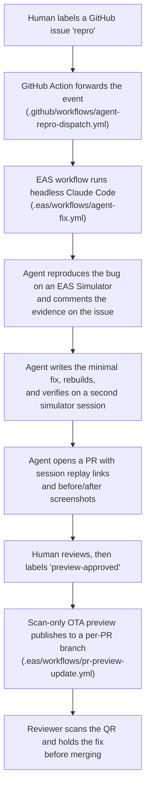

# Ripples

A private, local-first habit tracker for iOS. Built with [Expo](https://expo.dev) and [Claude Code](https://claude.com/claude-code).

This repo demonstrates two things:

1. **Native-feeling apps with Expo.** SwiftUI-backed UI, Home Screen widgets, App Intents, and private iCloud sync - all from one React Native codebase.
2. **Agentic EAS Workflows.** Label a GitHub issue `repro` and a headless agent reproduces the bug on a cloud simulator, fixes it, verifies the fix on-device, and opens a PR with watchable proof. A human reviews and merges.

## The app

You create visual boards for the things you want to track. One tap records a check-in. The app stays calm: no scores, no judgment, no dashboard on the home screen.

- Boards with seven-day strips, a one-year heatmap, streaks, and consistency views
- One-tap check-ins, plus manual entry for date, time, amount, and note
- Journal and full check-in history
- Local reminders by weekday and time
- Home Screen widgets in all sizes, with check-in from the widget
- Private iCloud sync (CloudKit), off by default
- Shortcuts and Siri through App Intents
- Full offline export through the native share sheet
- Light and dark appearance, Dynamic Type, VoiceOver

Everything lives in one SQLite database inside an iOS App Group. The app, the widgets, reminders, analytics, export, and sync all read the same source of truth.

## Native look, Expo stack

The whole product is Expo SDK 57 with Continuous Native Generation - no hand-edited `ios/` code.

| What | How |
| --- | --- |
| Native controls and sheets | [`@expo/ui`](https://docs.expo.dev/versions/latest/sdk/ui/) - real SwiftUI rendered from React |
| Home Screen widgets | `expo-widgets` with a shared App Group |
| Glass and blur effects | `expo-glass-effect`, `expo-blur` |
| Navigation | Expo Router with typed routes |
| Storage | `expo-sqlite` in the App Group container |
| Animation | Reanimated 4 + worklets |
| Reminders | `expo-notifications` |
| OTA updates | `expo-updates` + EAS Update |

## The agent pipeline

The part built for the video: a bug report becomes a verified fix PR without a human opening Xcode.



### Evidence on every run

Every agent run publishes, without exception:

- The EAS Simulator session URL for the repro session and the verification session. Anyone can watch the replay.
- A before-screenshot of the failing state and an after-screenshot of the fixed state. Even a crash gets its springboard moment on camera.

The full policy lives in [`.agents/prompts/fix-prompt.md`](.agents/prompts/fix-prompt.md).

### Guardrails

- The agent never merges, never touches `main`, never force-pushes. A human reviews every PR.
- The preview publish job runs in an EAS environment with **zero secrets**. An agent-authored branch is untrusted code until a human reviews it, so that job cannot see `CLAUDE_CODE_OAUTH_TOKEN`, `GITHUB_TOKEN`, or `EXPO_TOKEN`.
- Previews publish to a `pr-<n>` branch, never the shared `preview` channel. Nobody else's installed build changes.
- The preview label approves an exact commit. A later push does not republish; remove and reapply the label to approve the new revision.
- Fork PRs and draft PRs never trigger a preview.

### The workflow files

| File | Runs on | Does |
| --- | --- | --- |
| [`.github/workflows/agent-repro-dispatch.yml`](.github/workflows/agent-repro-dispatch.yml) | GitHub Actions | Thin bridge: `repro` label -> `eas workflow:run` |
| [`.eas/workflows/agent-fix.yml`](.eas/workflows/agent-fix.yml) | EAS Workflows | One headless Claude Code job: repro -> fix -> verify -> PR |
| [`.eas/workflows/pr-preview-update.yml`](.eas/workflows/pr-preview-update.yml) | EAS Workflows | `preview-approved` label -> scan-only OTA update + QR comment |

Secrets required: `EXPO_TOKEN` as a GitHub repo secret, plus `CLAUDE_CODE_OAUTH_TOKEN` (from `claude setup-token`), `GITHUB_TOKEN` (fine-grained PAT), and `EXPO_TOKEN` in the EAS `production` environment.

The pipeline pattern is adapted from [SchroederNathan/clarity](https://github.com/SchroederNathan/clarity).

## Run it yourself

Requires Bun and Xcode (the app is iOS-first).

```bash
bun install
bun run ios          # build and run on the iOS simulator
bun run start        # start the dev server
```

Quality gates:

```bash
bun run lint
bun run typecheck
bun run test
bun run validate     # lint + typecheck + tests with coverage
```

Cloud builds use EAS with the profiles in [`eas.json`](eas.json): `development`, `preview`, `sim` (iOS simulator build the agent uses), and `production`.

## How it was built

The product was specified before it was implemented. [`SPEC-native-foundation.md`](SPEC-native-foundation.md) defines the native foundation; [`SPEC-ripples-product.md`](SPEC-ripples-product.md) defines the full product. Claude Code implemented against those specs checkpoint by checkpoint ([`checkpoints.md`](checkpoints.md)), with an independent model verifying each phase.

## License

MIT - see [LICENSE](LICENSE).
